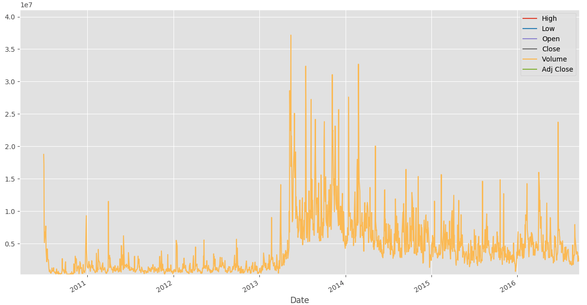
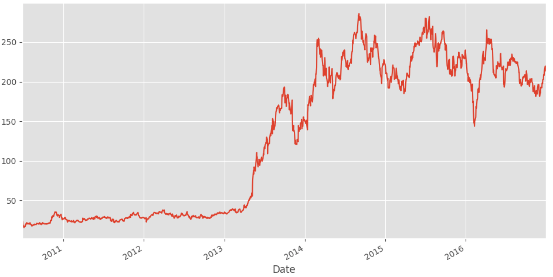

# Handling Data and Graphing
## - Python Programming for Finance p.2

# My Note
We will work with the data from previous file (p.1)
I got to know the following features:

```
import os
import os.path as path
# Resource file export
#ResourceDir =  path.abspath(path.join(__file__ ,"../..")) # It doesn't work so far.
#ResourceDir = path.abspath(path.join(os.getcwd(),"../..")) # To go two directories,
#ResourceDir = path.abspath(path.join(os.getcwd(),"../"))    # To go one directory back.
ResourceDir = os.getcwd()
```
to export a csv file after getting it use

```
pd_to.csv('Directory/name.csv')
```
after exporting we can read the file using

```
df = pd.read_csv(ResourceDir+ '/resources/tsla.csv', parse_dates = True, index_col = 0)
```
the **index_col** when it sets to (0), it means will set an index to the first column in our current dataframe.
* Note: we can read any type of data such as json, excel ..etc.

Now we will run some plot using the built-in plot function for pandas as shown below.

```
In Mac use:
import matplotlib
matplotlib.use('TkAgg')
import matplotlib.pyplot as plt
from matplotlib import style
style.use('ggplot')
```



# Note
As you can see form the figure above that assign the x-axis to the (**Date**) give us the x axis to the plot. To use a specific column of our current dataframe (**tsla.csv**) we can use simply:

```
df['Adj Close'].plot()
plt.show()
```



## Calling specific columns form our dataframe
There are several ways to do that and here are just the standard ones.

```
df[['Open','Close','Volume']]
Results

Name: Adj Close, Length: 1640, dtype: float64
                  Open       Close    Volume
Date
2010-06-29   19.000000   23.889999  18766300
2010-06-30   25.790001   23.830000  17187100
2010-07-01   25.000000   21.959999   8218800
```

# Inspiration

https://pythonprogramming.net/getting-stock-prices-python-programming-for-finance/
