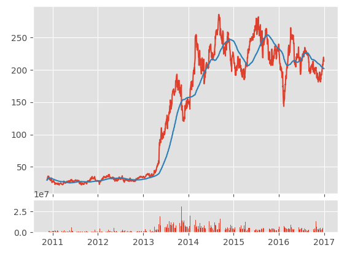
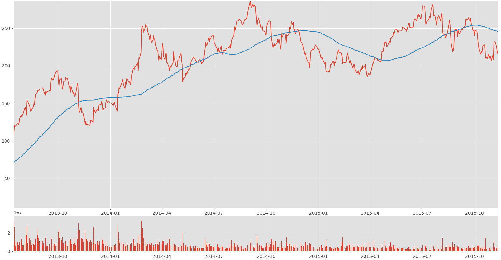

# Basic Stock data Manipulation
## - Python Programming for Finance p.3
Hello and welcome to part 3 of the Python for Finance tutorial series. In this tutorial, we're going to further break down some basic data manipulation and visualizations with our stock data. The starting code that we're going to be using (which was covered in the previous .py file).
# My Note
We have created a new column here called **100ma** which takes the means every 100 reading.

```
df['100ma'] = df['Adj Close'].rolling(window = 100).mean()
```
as you can see that take the mean of the **Adj Close** column and populate the column we created namely **100ma**. the values are shown as **NAN** for the first 100 reading because it needs 100 reading to start populate the results. Notice the date started at **2010-06-29** then when we dropped the values we got **2010-11-17** basically we lost 100 days that have non-values reading. We have added later the **min_peridos** for our calculation, the tail is different.

# We will use the Matplotlib plot instead of Pandas.Plot
Here will make more interactive figures **able to sync while zooming** and to do that we need to use the following featrues from **matplotlib**.

```
ax1 = plt.subplot2grid((6,1),(0,0), rowspan= 5, colspan= 1)
ax2 = plt.subplot2grid((6,1),(5,0), rowspan= 1, colspan= 1, sharex = ax1)
```
* Read more on this function here: https://matplotlib.org/api/_as_gen/matplotlib.pyplot.subplot2grid.html.

* Notice that the sharex is the parameter to make a sync for the two figures when you draw them and zoom on one figure the other figure will change.

Now we proceed with the graph to get the following:
Starting with


Then as we zoom more we can get:




# Inspiration

https://pythonprogramming.net/stock-data-manipulation-python-programming-for-finance/
