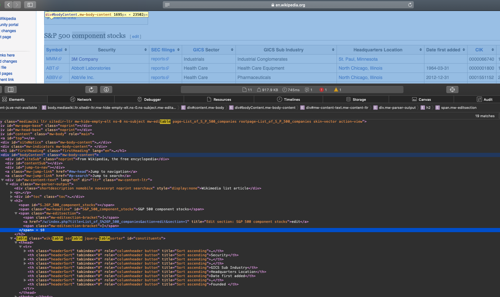

# Automating getting the S&P 500 list
## - Python Programming for Finance p.5
In this part of Python for Finance . In this tutorial and the next few, we're going to be working on how we can go about grabbing pricing information en masse for a larger list of companies, and then how we can work with all of this data at once.

To begin, we need a list of companies. I could just hand you a list, but actually acquiring a list of stocks can be just one of the many challenges you might encounter. In our case, we want a Python list of the S&P 500 companies.

Whether you are looking for the Dow Jones companies, the S&P 500, or the Russell 3000, chances are, someone somewhere has posted a post of these companies. You will want to make sure it is up-to-date, but chances are it's not already in the perfect format for you. In our case, we're going to grab the list from Wikipedia: http://en.wikipedia.org/wiki/List_of_S%26P_500_companies.

# My Note
Starting with importing some packages for this file we will need **beautiful soup** which is used to work on the text and using a very robust method to bring data. Also we will need **pickle** which is used to serilaze any python object and we dont need to import the website again. finally the **requests** is for attaching the website that we need to get the data from.
```
import bs4 as bs
import pickle
import requests

```
Using the inspector to get the table in your **html** file which is the website shown as: https://en.wikipedia.org/wiki/List_of_S%26P_500_companies.


As you can see there is a word for this type of table **class="wikitable sortable"** which we will add to our code

here is the function that we used

```
import bs4 as bs
import pickle
import requests

# Les get the data from the wikipedia from the link of all companies and search for a specific table
# You have to use the (Show inspection element of the html source file to know from where to start)

def save_sp500_tickers():
    resp    = requests.get('https://en.wikipedia.org/wiki/List_of_S%26P_500_companies')
    soup    = bs.BeautifulSoup(resp.text,features="lxml") # Now you store the website .html file as a .txt file
    table   = soup.find('table', {'class': 'wikitable sortable'})
    tickers = []
    for row in table.findAll('tr')[1:]: # tr: table row for your current table
        ticker = row.findAll('td')[0].text # getting the zero-column where the name of companies are.(colum name: Ticker symbol), also as this is a soup object we convert it to a text.count
        tickers.append(ticker)
    # Now we will save the file we created as an pickle object to not request from the website everytime
    with open("sp500tickers.pickle","wb") as f:
        pickle.dump(tickers,f)

    print(tickers)
    return tickers

save_sp500_tickers()

```


# Problem
We obtain a specific error on the following parsing
```
The code that caused this warning is on line 27 of the file /Users/ghasak/Desktop/My_DATA_MP/Learning/4_PythonforFinance/Projectfiles/P5_PyProforFinance.py. To get rid of this warning, pass the additional argument 'features="lxml"' to the BeautifulSoup constructor.
```
then I added the following
```
soup    = bs.BeautifulSoup(resp.text,features="lxml")
```
* Note: In my case Yahoo wasn't able to find alll the tickers. I had to replace the dots within the tickers, now it's running perfectly! Cheers
ticker = row.findAll('td')[0].text.replace('.','-')
# Output of running the file
We obtain the table of all the 500 companies using the ticker object from **beautifulsoup**.
```
['MMM\n', 'ABT\n', 'ABBV\n', 'ABMD\n', 'ACN\n', 'ATVI\n', 'ADBE\n', 'AMD\n', 'AAP\n', 'AES\n', 'AMG\n', 'AFL\n', 'A\n', 'APD\n', 'AKAM\n', 'ALK\n', 'ALB\n', 'ARE\n', 'ALXN\n', 'ALGN\n', 'ALLE\n', 'AGN\n', 'ADS\n', 'LNT\n', 'ALL\n', 'GOOGL\n', 'GOOG\n', 'MO\n', 'AMZN\n', 'AEE\n', 'AAL\n', 'AEP\n', 'AXP\n', 'AIG\n', 'AMT\n', 'AWK\n', 'AMP\n', 'ABC\n', 'AME\n', 'AMGN\n', 'APH\n', 'APC\n', 'ADI\n', 'ANSS\n', 'ANTM\n', 'AON\n', 'AOS\n', 'APA\n', 'AIV\n', 'AAPL\n', 'AMAT\n', 'APTV\n', 'ADM\n', 'ARNC\n', 'ANET\n', 'AJG\n', 'AIZ\n', 'ATO\n', 'T\n', 'ADSK\n', 'ADP\n', 'AZO\n', 'AVB\n', 'AVY\n', 'BHGE\n', 'BLL\n', 'BAC\n', 'BK\n', 'BAX\n', 'BBT\n', 'BDX\n', 'BRK.B\n', 'BBY\n', 'BIIB\n', 'BLK\n', 'HRB\n', 'BA\n', 'BKNG\n', 'BWA\n', 'BXP\n', 'BSX\n', 'BMY\n', 'AVGO\n', 'BR\n', 'BF.B\n', 'CHRW\n', 'COG\n', 'CDNS\n', 'CPB\n', 'COF\n', 'CPRI\n', 'CAH\n', 'KMX\n', 'CCL\n', 'CAT\n', 'CBOE\n', 'CBRE\n', 'CBS\n', 'CE\n', 'CELG\n', 'CNC\n', 'CNP\n', 'CTL\n', 'CERN\n', 'CF\n', 'SCHW\n', 'CHTR\n', 'CVX\n', 'CMG\n', 'CB\n', 'CHD\n', 'CI\n', 'XEC\n', 'CINF\n', 'CTAS\n', 'CSCO\n', 'C\n', 'CFG\n', 'CTXS\n', 'CLX\n', 'CME\n', 'CMS\n', 'KO\n', 'CTSH\n', 'CL\n', 'CMCSA\n', 'CMA\n', 'CAG\n', 'CXO\n', 'COP\n', 'ED\n', 'STZ\n', 'COO\n', 'CPRT\n', 'GLW\n', 'COST\n', 'COTY\n', 'CCI\n', 'CSX\n', 'CMI\n', 'CVS\n', 'DHI\n', 'DHR\n', 'DRI\n', 'DVA\n', 'DE\n', 'DAL\n', 'XRAY\n', 'DVN\n', 'FANG\n', 'DLR\n', 'DFS\n', 'DISCA\n', 'DISCK\n', 'DISH\n', 'DG\n', 'DLTR\n', 'D\n', 'DOV\n', 'DOW\n', 'DWDP\n', 'DTE\n', 'DRE\n', 'DUK\n', 'DXC\n', 'ETFC\n', 'EMN\n', 'ETN\n', 'EBAY\n', 'ECL\n', 'EIX\n', 'EW\n', 'EA\n', 'EMR\n', 'ETR\n', 'EOG\n', 'EFX\n', 'EQIX\n', 'EQR\n', 'ESS\n', 'EL\n', 'EVRG\n', 'ES\n', 'RE\n', 'EXC\n', 'EXPE\n', 'EXPD\n', 'EXR\n', 'XOM\n', 'FFIV\n', 'FB\n', 'FAST\n', 'FRT\n', 'FDX\n', 'FIS\n', 'FITB\n', 'FE\n', 'FRC\n', 'FISV\n', 'FLT\n', 'FLIR\n', 'FLS\n', 'FLR\n', 'FMC\n', 'FL\n', 'F\n', 'FTNT\n', 'FTV\n', 'FBHS\n', 'FOXA\n', 'FOX\n', 'BEN\n', 'FCX\n', 'GPS\n', 'GRMN\n', 'IT\n', 'GD\n', 'GE\n', 'GIS\n', 'GM\n', 'GPC\n', 'GILD\n', 'GPN\n', 'GS\n', 'GWW\n', 'HAL\n', 'HBI\n', 'HOG\n', 'HRS\n', 'HIG\n', 'HAS\n', 'HCA\n', 'HCP\n', 'HP\n', 'HSIC\n', 'HSY\n', 'HES\n', 'HPE\n', 'HLT\n', 'HFC\n', 'HOLX\n', 'HD\n', 'HON\n', 'HRL\n', 'HST\n', 'HPQ\n', 'HUM\n', 'HBAN\n', 'HII\n', 'IDXX\n', 'INFO\n', 'ITW\n', 'ILMN\n', 'IR\n', 'INTC\n', 'ICE\n', 'IBM\n', 'INCY\n', 'IP\n', 'IPG\n', 'IFF\n', 'INTU\n', 'ISRG\n', 'IVZ\n', 'IPGP\n', 'IQV\n', 'IRM\n', 'JKHY\n', 'JEC\n', 'JBHT\n', 'JEF\n', 'SJM\n', 'JNJ\n', 'JCI\n', 'JPM\n', 'JNPR\n', 'KSU\n', 'K\n', 'KEY\n', 'KEYS\n', 'KMB\n', 'KIM\n', 'KMI\n', 'KLAC\n', 'KSS\n', 'KHC\n', 'KR\n', 'LB\n', 'LLL\n', 'LH\n', 'LRCX\n', 'LW\n', 'LEG\n', 'LEN\n', 'LLY\n', 'LNC\n', 'LIN\n', 'LKQ\n', 'LMT\n', 'L\n', 'LOW\n', 'LYB\n', 'MTB\n', 'MAC\n', 'M\n', 'MRO\n', 'MPC\n', 'MAR\n', 'MMC\n', 'MLM\n', 'MAS\n', 'MA\n', 'MAT\n', 'MKC\n', 'MXIM\n', 'MCD\n', 'MCK\n', 'MDT\n', 'MRK\n', 'MET\n', 'MTD\n', 'MGM\n', 'MCHP\n', 'MU\n', 'MSFT\n', 'MAA\n', 'MHK\n', 'TAP\n', 'MDLZ\n', 'MNST\n', 'MCO\n', 'MS\n', 'MOS\n', 'MSI\n', 'MSCI\n', 'MYL\n', 'NDAQ\n', 'NOV\n', 'NKTR\n', 'NTAP\n', 'NFLX\n', 'NWL\n', 'NEM\n', 'NWSA\n', 'NWS\n', 'NEE\n', 'NLSN\n', 'NKE\n', 'NI\n', 'NBL\n', 'JWN\n', 'NSC\n', 'NTRS\n', 'NOC\n', 'NCLH\n', 'NRG\n', 'NUE\n', 'NVDA\n', 'ORLY\n', 'OXY\n', 'OMC\n', 'OKE\n', 'ORCL\n', 'PCAR\n', 'PKG\n', 'PH\n', 'PAYX\n', 'PYPL\n', 'PNR\n', 'PBCT\n', 'PEP\n', 'PKI\n', 'PRGO\n', 'PFE\n', 'PM\n', 'PSX\n', 'PNW\n', 'PXD\n', 'PNC\n', 'PPG\n', 'PPL\n', 'PFG\n', 'PG\n', 'PGR\n', 'PLD\n', 'PRU\n', 'PEG\n', 'PSA\n', 'PHM\n', 'PVH\n', 'QRVO\n', 'PWR\n', 'QCOM\n', 'DGX\n', 'RL\n', 'RJF\n', 'RTN\n', 'O\n', 'RHT\n', 'REG\n', 'REGN\n', 'RF\n', 'RSG\n', 'RMD\n', 'RHI\n', 'ROK\n', 'ROL\n', 'ROP\n', 'ROST\n', 'RCL\n', 'CRM\n', 'SBAC\n', 'SLB\n', 'STX\n', 'SEE\n', 'SRE\n', 'SHW\n', 'SPG\n', 'SWKS\n', 'SLG\n', 'SNA\n', 'SO\n', 'LUV\n', 'SPGI\n', 'SWK\n', 'SBUX\n', 'STT\n', 'SYK\n', 'STI\n', 'SIVB\n', 'SYMC\n', 'SYF\n', 'SNPS\n', 'SYY\n', 'TROW\n', 'TTWO\n', 'TPR\n', 'TGT\n', 'TEL\n', 'FTI\n', 'TFX\n', 'TXN\n', 'TXT\n', 'TMO\n', 'TIF\n', 'TWTR\n', 'TJX\n', 'TMK\n', 'TSS\n', 'TSCO\n', 'TDG\n', 'TRV\n', 'TRIP\n', 'TSN\n', 'UDR\n', 'ULTA\n', 'USB\n', 'UAA\n', 'UA\n', 'UNP\n', 'UAL\n', 'UNH\n', 'UPS\n', 'URI\n', 'UTX\n', 'UHS\n', 'UNM\n', 'VFC\n', 'VLO\n', 'VAR\n', 'VTR\n', 'VRSN\n', 'VRSK\n', 'VZ\n', 'VRTX\n', 'VIAB\n', 'V\n', 'VNO\n', 'VMC\n', 'WAB\n', 'WMT\n', 'WBA\n', 'DIS\n', 'WM\n', 'WAT\n', 'WEC\n', 'WCG\n', 'WFC\n', 'WELL\n', 'WDC\n', 'WU\n', 'WRK\n', 'WY\n', 'WHR\n', 'WMB\n', 'WLTW\n', 'WYNN\n', 'XEL\n', 'XRX\n', 'XLNX\n', 'XYL\n', 'YUM\n', 'ZBH\n', 'ZION\n', 'ZTS\n']
```
# Inspiration

https://pythonprogramming.net/sp500-company-list-python-programming-for-finance/
