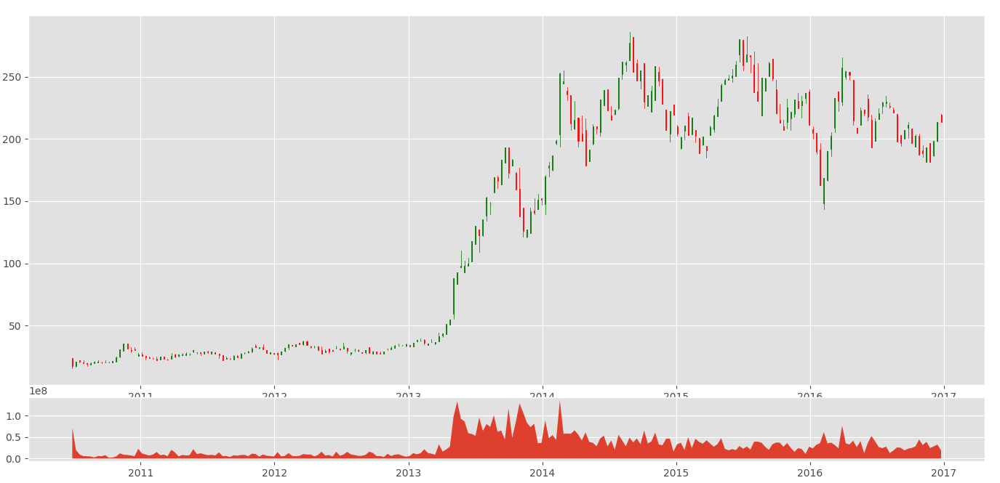
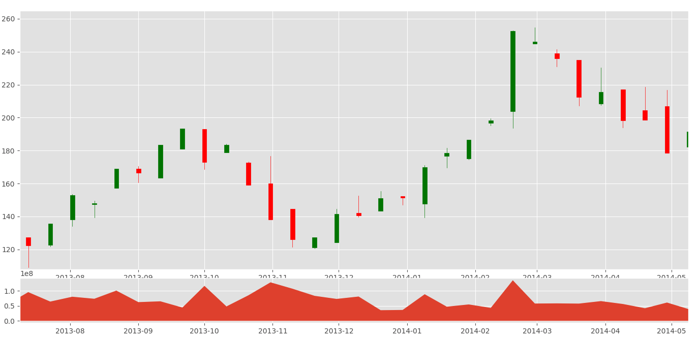

# More stock manipulations
## - Python Programming for Finance p.4
Hello and welcome to part 4 of the Python for Finance tutorial series. In this tutorial, we're going to create a candlestick / OHLC graph based on the Adj Close column, which will allow me to cover resampling and a few more data visualization concepts.

An OHLC chart, called a candlestick chart, is a chart that condenses the open, high, low, and close data all in one nice format. Plus it makes pretty colors, and remember what I told you about good looking charts?

Starting code that's been covered up to this point in previous tutorials:
# My Note
Staring with the re-sampling
starting with re-sampling
You can make it weekly or monthly e.g. 'Min'..etc
Here we will do every 10 days take the mean,
Open high low close also can do which we will work on it now, it will shrink our data.

# Problem with canlestick_ohlc
in 2019 the modular **from matplotlib.finance import candlestick_ohlc** is no longer working. Instead you can follow the discussion in StackOverFlow here
https://stackoverflow.com/questions/42373104/since-matplotlib-finance-has-been-deprecated-how-can-i-use-the-new-mpl-finance
and you can see that the modular is working as

```
either use: pip install https://github.com/matplotlib/mpl_finance/archive/master.zip

or

pip install mpl_finance

and import the modular using:
from mpl_finance import candlestick_ohlc

```

# Continue Our Notes
candlestick_ohlc needs **Date**,
we are having now df_ohlc which is using average every **10 days** and we will reset the index of this dataframe using:

```
df_ohlc.reset_index(inplace = True)
```
Now we will do mapping but not fancy mapping, to converate the **Date** to **mDate** offered by the package **matplotlib.dates**.



and if we zoom more we get



It is a nice figure shows you the open price and closing price in one line for the specific day given the features as shown in the figure.

# Final Minor Issue
For current file run we get the message
_converter.py:129: FutureWarning: Using an implicitly registered datetime converter for a matplotlib plotting method. The converter was registered by pandas on import. Future versions of pandas will require you to explicitly register matplotlib converters.

To register the converters:
	>>> from pandas.plotting import register_matplotlib_converters
	>>> register_matplotlib_converters()
  warnings.warn(msg, FutureWarning)
maybe in the future we need to do this
```
from pandas.plotting import register_matplotlib_converters
register_matplotlib_converters()
```

# Inspiration

https://pythonprogramming.net/more-stock-data-manipulation-python-programming-for-finance/
