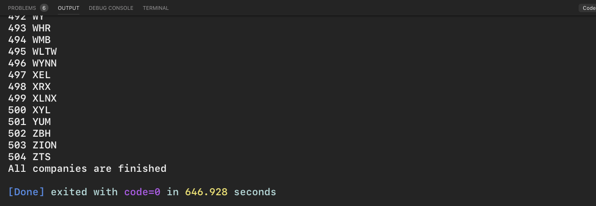

# Getting all company pricing data in the S&P 500
## - Python Programming for Finance p.6
Hello and welcome to part 6 of the Python for Finance tutorial series. In the previous finance with Python tutorial, we covered how to acquire the list of companies that we're interested in (S&P 500 in our case), and now we're going to pull stock pricing data on all of them.

# Output

# My Note
Since we already have grabbed the data as **.pickle** from last script.p5, now we will comment the **save_sp500_tickers()** function to move to the next step.
Starting with reading the data that we saved before in the format **.pickle** and we will use basically the new function with the following format

```
def get_data_from_yahoo(reload_sp500 = False):
    if reload_sp500:
        tickers = save_sp500_tickers()
    else:
        with open(ResourceDir+"/resources/sp500tickers.pickle","rb") as f: # rb for read the file
        tickers = pickle.load(f)
```
Here will create a relative directory using the os functionality **stock_dfs**. The purpose is to get the stocks for each company of our current 500 companies file.

# Problem 1
I was able to solve a problem in the code using the regular expression method **rstrip()** which remove the value of **\n** - new line. The function now is working

# Problem 2

There are some company I couldnt get their stock files using the **yahoo** data grabber. then I have added this code to git rid of them.
```
non_valid_company = ["BDX","BBT","CF","COST","DOW","EVRG","HIG"]
with if statement checking as
if ticker in non_valid_company:
            continue

```
* Note: I have used continue rather than pass, because I don't want the checking to do nothing and go to next step, while continue will go to for and proceed to the next iteration.


# Creative Adding:
As I would like to get an indication to show the final step in the loop of **tickers** list. then I found a good way to do so according to the following thread:

```
Index Method

urlist_len = len(urlist)-1
for x in urlist:
    if urlist.index(x) == urlist_len:
        pass
Negative Slice Method

for x in urlist:
    if x == urlist[-1]:
        pass
Enumerate Method

urlist_len = len(urlist)-1
for index, x in enumerate(urlist):
    if index == urlist_len:
        pass
Here are some timing for some different methods:

╔════════════════════════════════════════════════════════════════╗
║                       Timing Results (s)                       ║
╠═══════════════════════╦════╦═════════╦════════╦═══════╦════════╣
║ List size             ║ 20 ║ 200     ║ 2000   ║ 20000 ║ 200000 ║
╠═══════════════════════╬════╬═════════╬════════╬═══════╬════════╣
║                       ║ 0  ║ 0.0006  ║ 0.051  ║ 5.2   ║ 560    ║
║ Index Method          ║    ║         ║        ║       ║        ║
╠═══════════════════════╬════╬═════════╬════════╬═══════╬════════╣
║                       ║ 0  ║ 0       ║ 0.0002 ║ 0.003 ║ 0.034  ║
║ Negative Slice Method ║    ║         ║        ║       ║        ║
╠═══════════════════════╬════╬═════════╬════════╬═══════╬════════╣
║ Enumerate Method      ║ 0  ║ 0.00004 ║ 0.0005 ║ 0.016 ║ 0.137  ║
╚═══════════════════════╩════╩═════════╩════════╩═══════╩════════╝
Note: values <10us rounded to 0

As you can see, the index method is always slower, and it only get exponentially worse as the list size increases. I don't see any reason to use it ever. The Negative slice method is the fastest in all cases, but if you have duplicate items in your list, it will give you a false positive. Also, the negative slice method requires that the sequence you are iterating over supports indexing. So, in the case of duplicate items in your list (or not index supporting sequence) use the fast-but-not-fastest enumerate method.

Edit: as a commentator noted, calculating the length of the list within the loop isn't ideal. I was able to shave 35% off the enumerate method (not reflected in the table at this moment) using this knowledge.

tldr: use negative slice if all elements are unique and sequence supports indexing, otherwise enumerate method
```
Check more details here:
https://stackoverflow.com/questions/39808908/detect-if-item-is-the-last-in-a-list

### What I modified in the code
Here is my loop style:

```
non_valid_company = ["BDX","BBT","CF","COST","DOW","EVRG","EW","HIG", "COTY", "LIN", "OKE","JNJ","PNW","PPG","DGX","VMC","ZBH"]
    tickers_len = len(tickers)-1
    for index,ticker in enumerate(tickers):
        print(index,ticker)
        #print("\n")
        #os.system('clear')
        if ticker in non_valid_company:
            continue
        else:
            if not os.path.exists(ResourceDir+"/resources/stock_dfs/{}.csv".format(ticker)):
                #counter = counter+1
                df = web.DataReader(ticker, 'yahoo', start, end)
                df.to_csv(ResourceDir+"/resources/stock_dfs/{}.csv".format(ticker))
            else:
                print('Already have {}'.format(ticker))

        if index == tickers_len:
            print("All companies are finished")
```
# Inspiration

https://pythonprogramming.net/sp500-company-price-data-python-programming-for-finance/
