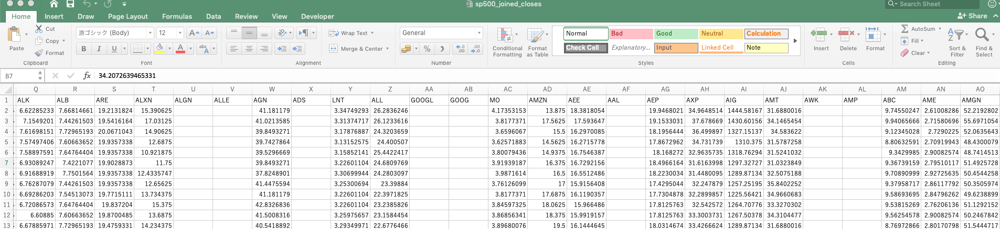
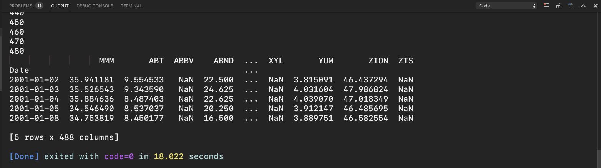

# Combining the S&P 500 Data
## - Python Programming for Finance p.7

Hello and welcome to part 7 of the Python for Finance tutorial series. In the previous tutorial, we grabbed the Yahoo Finance data for the entire S&P 500 of companies. In this tutorial, we're going to bring this data together into one DataFrame.

# Output
To Run this in terminal use

```
python Projectfiles/P7_ProforFinanace.py
```

Also you through VSCODE:

# My Note
We have got all the company information that we need, now we will combine them all together. Pulling all the (API) locally of all **Fortune SP 500** and it is better to pull all information together and store them. We will combine all the **Adjust Close**

# Problem
Similar to previous after we got all names of the companies the we were able to grab only the one online and store them locally. Therefore, the tickers should be updated to the only files we are having right now. To do so I approached this through removing the items ** company names** from the **tickers** list. There are several ways to do so such as **list.remove()** **list.pop()** and so on. read more here:
https://www.quora.com/How-do-I-remove-an-item-from-a-python-list
*Note: The only one was working is through **list-Comprehension** as following:

```
tickers = [item for item in tickers if item not in non_valid_company]
```
See here:
https://stackoverflow.com/questions/4211209/remove-all-the-elements-that-occur-in-one-list-from-another


# Inspiration

https://pythonprogramming.net/sp500-company-price-data-python-programming-for-finance/
